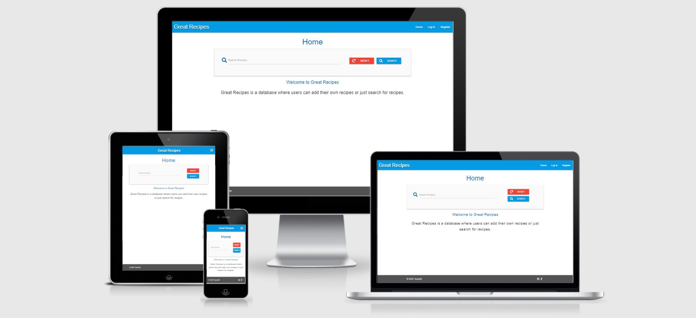

<h1 align="center">Great Recipes Website</h1>

[View the live project here.](https://flask-great-recipes.herokuapp.com/home)

This is the website for the Great Recipes database. It is designed to be responsibe and accessible on a range of devices, making it easy to navigate for all users.

<h2 align="center"></h2>

## User Experience (UX)

-   ### User stories

    -   #### First Time Visitor Goals

        1. As a First Time Visitor, I want to easily understand the main purpose of the site.
        2. As a First Time Visitor, I want to be able to easily navigate throughout the site to find recipes.
        3. As a First Time Visitor, I want to locate the sites social media links to see their followings on social media to determine what people think of the website and the recipes.

    -   #### Returning Visitor Goals

        1. As a Returning Visitor, I want to quickly finds recipes that I'm interested in. 
        2. As a Returning Visitor, I want to find community links.


    -   #### Frequent User Goals
        1. As a Frequent User, I want to add my own recipes.


-   ### Design
    -   #### Colour Scheme
        -   The two main colours used are light blue and white.

    -   #### Typography
        -   The Montserrat font is the main font used throughout the whole website with Sans Serif as the fallback font in case for any reason the font isn't being imported into the site correctly. Montserrat is a clean font used frequently in programming, so it is both attractive and appropriate.

    -   #### Imagery
        -   TBD. Add hero image to Home page.


*   ### Wireframes

    -   Home Page Wireframe - [View](wireframe_and_database_design/great_recipes_home.pdf)
    -   Register Page Wireframe - [View](wireframe_and_database_design/great_recipes_register.pdf)
    -   Login Page Wireframe - [View](wireframe_and_database_design/great_recipes_login.pdf)
    -   Add Recipe Page Wireframe - [View](wireframe_and_database_design/great_recipes_add_recipe.pdf)
    -   Manage Cuisine Wireframe - [View](wireframe_and_database_design/great_recipes_manage_cuisine.pdf)


        The reader has access to the Home, Register and Login Pages.
        The registered user has access to the Home and Add Recipe Pages. The Registered user can also Log out.
        The admin has access to the Home, Add Recipe and Manage Cuisine Pages. The admin can also Log out.

        A button to allow the Admin togenerate a search index was added.
        A My Recipes button was added so that users can click on the recipes they added without searching for them.

*   ### Database Design

    -   Database Design - [View](wireframe_and_database_design/quickdbd-recipe.png)


## Features

-   Responsive on all device sizes to a Galaxy Fold.


## Technologies Used

### Languages Used

-   [HTML5](https://en.wikipedia.org/wiki/HTML5)
-   [CSS3](https://en.wikipedia.org/wiki/Cascading_Style_Sheets)
-   [Jinja2](https://en.wikipedia.org/wiki/Jinja_(template_engine))
-   [Python3](https://en.wikipedia.org/wiki/Python_(programming_language))
-   [jQuery](https://en.wikipedia.org/wiki/JQuery)
-   [Markdown](https://en.wikipedia.org/wiki/Markdown)
-   [JavaScript](https://en.wikipedia.org/wiki/JavaScript)


### Frameworks, Libraries & Programs Used

1. [MaterializeCSS:](https://materializecss.com/)
    - Materialize is a framework which was used to assist with the styling of the website.
1. [Google Fonts:](https://fonts.google.com/)
    - Google fonts were used to import the Montserrat and sans-serif font into the style.css file which is used on all pages throughout the project.
1. [Font Awesome:](https://fontawesome.com/)
    - Font Awesome was used on all pages throughout the website to add icons for aesthetic and UX purposes.
1. [Git](https://git-scm.com/)
    - Git was used for version control by utilizing the Gitpod terminal to commit to Git and Push to GitHub.
1. [Gitpod](https://www.gitpod.io/)
    - The Gitpod workspace was used to develop the HTML5, CSS3, Jinja2, JavaScript and Python3 code.
1. [GitHub:](https://github.com/)
    - GitHub is used to store the projects code after being pushed from Git.
1. [Balsamiq:](https://balsamiq.com/)
    - Balsamiq was used to create the [wireframes](wireframe_and_database_design/) during the design process.
1. [Cloudinary:](https://cloudinary.com/)
    - Cloudinary was used create landscape recipe images and to host the images.
1. [mongoDB:](https://www.mongodb.com/)
    - mongoDB was used create the database to store the recipes, cuisines and user details.
1. [Flask:](https://www.mongodb.com/)
    - Flask is a python framework with Werkzeug and Jinja.

### Font Awesome Icons Used

- fas fa-search
- fas fa-redo
- fas fa-folder-open
- fas fa-pencil-alt
- fas fa-align-left
- fas fa-upload
- fas fa-times-circle
- fas fa-plus-square
- fas fa-folder-plus
- fab fa-instagram
- fab fa-facebook-f

## Testing

The W3C Markup Validator, W3C CSS Validator, jshint and PEP8 Services were used to validate every page of the project to ensure there were no syntax errors in the project.

The HTML code contained jinja so a validation the html file woud have errors.
The rendered Heroku webpage HTML code (viewed with view page source) was copied into the Markup validator for each page.

-   [W3C Markup Validator](https://jigsaw.w3.org/css-validator/#validate_by_input) - [Results](validation/html/)
-   [W3C CSS Validator](https://jigsaw.w3.org/css-validator/#validate_by_input) - [Results](validation/css/css_checker.pdf)
-   [jshint](https://jshint.com/) - [Results](validation/js/javascript_checker.txt)
-   [http://pep8online.com/](validation/python/pep8_online_check_results.pdf) - [Results](validation/python/pep8_online_check_results.pdf)

All validators passed

### Usernames and Passwords

-   username:timothy password:12345678
-   username:admin password:12345678

### Testing User Stories from User Experience (UX) Section

-   #### First Time Visitor Goals

    1. As a First Time Visitor, I want to easily understand the main purpose of the site.
        1. Upon entering the site, users are automatically greeted with a clean and easily readable navigation bar to go to the page of their choice.
        2. Underneath there is search box to search for reipes.
        3. Underneath that there is a welcome statement explaining the purpose of the site.
        4. The user has two options, search for a recipe or navigate to the other pages.

    2. As a First Time Visitor, I want to be able to easily navigate throughout the site to find recipes.
        1. The site has been designed to be fluid and never to entrap the user. At the top of each page there is a clean navigation bar, each link clearly describes the purpose of the page they will end up at.

    3. As a First Time Visitor, I want to locate the sites social media links to see their followings on social media to determine what people think of the website and the recipes.
        1. The user can scroll to the bottom of any page on the site to locate social media links in the footer.
        

-   #### Returning Visitor Goals

    1. As a Returning Visitor, I want to quickly finds recipes that I'm interested in. 
        1. The search recipes window is available on the landing page to help users find recipes.
      

    2. As a Returning Visitor, I want to find community links.
        1. The footer contains links to the organisations Facebook and Instagram page.
        2. Whichever social media link they click, it will be open up in a new tab to ensure the user can easily get back to the website.
      

-   #### Frequent User Goals

    1. As a Frequent User, I want to add my own recipes.
        1. The user would already be comfortable with the website layout and can easily click the Add Recipe Banner.
        2. The Add recipe page contains instructions on how to successfully add a recipe.


### Force URL defensive code testing

The block_force_url function is not working now. Working code from an earlier commit does not work now either.
Tutor support was contacted but contact was lost when we decided to go with a reboot.
Code seemed to be working up to redirect(url_for("home")).
Must park code as is for now.

All force URL's were tested without user or admin logged in.

Reader URL's do not need to be tested.
-   http://flask-great-recipes.herokuapp.com/home
-   http://flask-great-recipes.herokuapp.com/login
-   http://flask-great-recipes.herokuapp.com/register

User URL's
-   http://flask-great-recipes.herokuapp.com/home - Reader URL renders ok.
-   http://flask-great-recipes.herokuapp.com/recipes - Reader URL renders ok.
-   http://flask-great-recipes.herokuapp.com/my_recipes/ Internal Server Error with any text after /
-   http://flask-great-recipes.herokuapp.com/my_recipes/ Great Recipes 404 page ok
-   http://flask-great-recipes.herokuapp.com/add_recipe/ Renders page with any text after /
-   http://flask-great-recipes.herokuapp.com/add_recipe/ Great Recipes 404 page ok
-   http://flask-great-recipes.herokuapp.com/search_user/ Internal Service Error with any text after /
-   http://flask-great-recipes.herokuapp.com/search_user/ Great Recipes 404 page ok

Admin URL's
-   http://flask-great-recipes.herokuapp.com/home - Reader URL renders ok.
-   http://flask-great-recipes.herokuapp.com/my_recipes/ Internal Server Error with any text after /
-   http://flask-great-recipes.herokuapp.com/my_recipes/ Great Recipes 404 page ok
-   http://flask-great-recipes.herokuapp.com/search_user/ Internal Server Error with any text after /
-   http://flask-great-recipes.herokuapp.com/search_user/ Great Recipes 404 page ok
-   http://flask-great-recipes.herokuapp.com/my_recipes/ Internal Server Error with any text after /
-   http://flask-great-recipes.herokuapp.com/my_recipes/ Great Recipes 404 page ok
-   http://flask-great-recipes.herokuapp.com/add_recipe/ Page renders with any text after /
-   http://flask-great-recipes.herokuapp.com/add_recipe/ Great Recipes 404 page ok
-   http://flask-great-recipes.herokuapp.com/admin_recipes/ Page renders with any text after /
-   http://flask-great-recipes.herokuapp.com/admin_recipes/ Great Recipes 404 page ok
-   http://flask-great-recipes.herokuapp.com/cuisines/ Page renders with any text after /
-   http://flask-great-recipes.herokuapp.com/cuisines/ Great Recipes 404 page ok
-   http://flask-great-recipes.herokuapp.com/add_cuisine/ Page renders with any text after /
-   http://flask-great-recipes.herokuapp.com/add_cuisine/ Great Recipes 404 page ok
-   http://flask-great-recipes.herokuapp.com/generate_index/ Page renders with any text after /
-   http://flask-great-recipes.herokuapp.com/generate_index/ Great Recipes 404 page ok


### Functional Testing

-   Every button and link on the site was checked for its expected operation.

### Further Testing

-   The Website was tested on Google Chrome, Internet Explorer and Microsoft Edge.
-   The website was viewed on a variety of devices such as Desktop, Laptop, iPhone7, iPhone 8 & iPhoneX.
-   A large amount of testing was done to ensure that all pages were linking correctly.
-   Friends and family members were asked to review the site and documentation to point out any bugs and/or user experience issues.
-   A user is likely to use a PC with a keyboard to enter recipe data.


### Known Bugs

-   Bug discovered at last minute on gitpod. Edit Recipe, recipe name and picture fields have what looks like a carriage return. This is likely due to a recent change from input to textarea on these fields. The additional spaces can be deleted before the recipe is saved. Heroku deployement does not have this bug.

-   The force URL defensive code is not returning the user to the home page.

## Deployment

### GitHub Pages

The project was deployed to GitHub Pages using the following steps...

1. Log in to GitHub and locate the [GitHub Repository](https://github.com/fene20/great-recipes)
2. At the top of the Repository (not top of page), locate the "Settings" Button on the menu.
3. Scroll down the Settings page until you locate the "GitHub Pages" Section.
4. Under "Source", click the dropdown called "None" and select "Master Branch".
5. The page will automatically refresh.
6. Scroll back down through the page to locate the now published site [link](https://8080-teal-lobster-b2qs96iu.ws-eu15.gitpod.io/) in the "GitHub Pages" section.

### Forking the GitHub Repository

By forking the GitHub Repository we make a copy of the original repository on our GitHub account to view and/or make changes without affecting the original repository by using the following steps...

1. Log in to GitHub and locate the [GitHub Repository](https://github.com/fene20/great-recipes)
2. At the top of the Repository (not top of page) just above the "Settings" Button on the menu, locate the "Fork" Button.
3. You should now have a copy of the original repository in your GitHub account.

### Making a Local Clone

1. Log in to GitHub and locate the [GitHub Repository](https://github.com/fene20/great-recipes)
2. Under the repository name, click "Clone or download".
3. To clone the repository using HTTPS, under "Clone with HTTPS", copy the link.
4. Open Git Bash
5. Change the current working directory to the location where you want the cloned directory to be made.
6. Type `git clone`, and then paste the URL you copied in Step 3.

```
$ git clone https://github.com/YOUR-USERNAME/YOUR-REPOSITORY
```

7. Press Enter. Your local clone will be created.

```
$ git clone https://github.com/YOUR-USERNAME/YOUR-REPOSITORY
> Cloning into `CI-Clone`...
> remote: Counting objects: 10, done.
> remote: Compressing objects: 100% (8/8), done.
> remove: Total 10 (delta 1), reused 10 (delta 1)
> Unpacking objects: 100% (10/10), done.
```

Click [Here](https://help.github.com/en/github/creating-cloning-and-archiving-repositories/cloning-a-repository#cloning-a-repository-to-github-desktop) to retrieve pictures for some of the buttons and more detailed explanations of the above process.

## Credits

### Code

-   This project is based on the Code Institute Data Centric Development Mini Project.
-   [MaterializeCSS:](https://materializecss.com/) Materialize is a framework which was used to assist with the styling of the website.
-   [Flask:](https://www.mongodb.com/) Flask is a python framework with Werkzeug and Jinja.
-   [mongoDB:](https://www.mongodb.com/) mongoDB was used create the database to store the recipes, cuisines and user details.
-   Credit  https://stackoverflow.com/questions/45719062/jinja-docx-template-avoiding-new-line-in-nested-for/45719723 for code to not add a carriage return on the last loop.

-   Credit  https://www.tutorialspoint.com/list-all-values-of-a-certain-field-in-mongodb for code to prevent the adding of duplicate cuisine names.

-   Credit https://materializecss.com/ for footer code.

-   Credit https://stackoverflow.com/questions/58232219/how-do-i-remove-font-awesome-icons-on-my-responsive-navbar-when-in-desktop-versi for code to hide icons on small devices.

-   Credit Tutor support and Flask https://flask.palletsprojects.com/en/1.1.x/patterns/errorpages/ for Error 404 support.

-   Credit Tutor support for #search-window input[type="text"] to target margin.

-   Credit Tutor support for code to wrap div's as required on small devices.

Larger device.

.collapsible-header {
  display: flex;
  flex-direction: row;
}

Smaller device.

  .collapsible-header {
    flex-direction: column;
  }

### Content

-   All content was written by the developer.

-   Psychological properties of colours text in the README.md was found [here](http://www.colour-affects.co.uk/psychological-properties-of-colours)

### Media

-   All Images were created by the developer.

### Acknowledgements

-   My Mentor for continuous helpful feedback.
-   Tutor support at Code Institute for their support.

### TBD

-   Add date that recipe was created to support listing new recipies first.
-   Add hero image of nice looking recipe to the home page.
-   Add favicon.
-   Add active site underscore.

### BUGS
-   Very small bug. The project was saving cuisine_name instead of cuisine_style in the DB. Changed all references from cuisine_name to cuisine_style.

-   Very small bug. Recipies.html was showing no results found. Code had  instead of 

-   Very small bug. my_recipes.html had the same code as recipies.html but was not listing the recipes. Added recipes = list(mongo.db.recipes.find()) to my_recipies in app.py.

-   Very small bug. The collapsed search bar was being displayed on my_recipe.html. Changed search to
recipes = list(mongo.db.recipes.find({"created_by": username, "$text": {"$search": query}}))
so recipes would be empty if there was no result found.

-   Small bug. edit_recipe.html Ingredients were not being displayed on screen in one column. The 2nd and third elements were indented. https://stackoverflow.com/questions/45719062/jinja-docx-template-avoiding-new-line-in-nested-for/45719723 detailed {{ '\n' -}} solution. {{ '\n' }} prevented the last CR.

-   Bug. Materialize pop up was deleting the first recipe not the one selected. Used variable instead of href="#modal1"

Added data-target="{{ recipe._id }} to Modal trigger
Added id="{{ recipe._id }}" to modal structure.

-   Bug. Existing add cuisine code allowed the adding of Thai followed by thai but not thai followed by Thai. The code must not allow any duplication of cuisine name.

original code:

existing_cuisine = mongo.db.cuisines.find_one({"cuisine_style": request.form.get("cuisine_style").lower()})
if existing_cuisine:
    flash("Cuisine already exists")
    return redirect(url_for("get_cuisines"))

            
existing_cuisine = mongo.db.cuisines.find_one({"cuisine_style": request.form.get("cuisine_style").lower()})
if existing_cuisine:
    flash("Cuisine already exists")
    return redirect(url_for("get_cuisines"))

Credit  https://www.tutorialspoint.com/list-all-values-of-a-certain-field-in-mongodb

fixed code:

new_style = request.form.get("cuisine_style").lower()
db_styles = mongo.db.cuisines.distinct("cuisine_style")

for style in db_styles:
    if style.lower() == new_style:
        flash("Cuisine already exists")
        return redirect(url_for("get_cuisines"))

use .distinct() function

New code converts both database cuisine_style and form cuisine_style to lowercase and compares that.

This code is not needed for new recipe as there can be multiple recipies with the same name.


-   Bug. Tested force url in my_recipes by forcing URL https://8080-teal-lobster-b2qs96iu.ws-eu13.gitpod.io/my_recipes/timothy 

Getting a Key Error user when logged out.

Rearranged code to put session["user"] variable after if session:

-   Bug. Forcing URL for logout when not logged in gives a key error. Added defensive code here too.

-   Bug. force URL of https://8080-teal-lobster-b2qs96iu.ws-eu13.gitpod.io/search_user/jack
gives pymongo.errors.OperationFailure
Add defensive programming here too.


-   bug.
TypeError: 'NoneType' object is not iterable
reset button on all recipes page would not work. tracked down to null element in Mongo DB.

-   Bug.
Edit recipe cancel button did not work.
werkzeug.routing.BuildError
werkzeug.routing.BuildError: Could not build url for endpoint 'edit_recipe' with values ['recipe_id']. Did you forget to specify values ['username']?

Due to commented out code in recipes.html.
                            <!-- 
                                <a href="{{ url_for('edit_recipe', recipe_id=recipe._id) }}" class="btn-small light-blue lighten-1">Edit</a>
                                <a href="{{ url_for('delete_recipe', recipe_id=recipe._id) }}" class="btn-small red text-shadow">Delete</a>
                                                    -->

-   Bug.
Edit recipe save edits button did not work.
TypeError: 'NoneType' object is not iterable
due to null in database ingredients, i.e. not an array.

-   Bug.
Coud not edit a recipe and save it again even with no changes.
AttributeError: 'NoneType' object has no attribute 'split'
ingredients (but not preperation_steps or tools) in edit_recipe.html was declared as an array with id/name/for="ingredients[]"
removed square brackets to fix.

-   Bug.
Credit stack overflow. Hide icons on small devices.
https://stackoverflow.com/questions/58232219/how-do-i-remove-font-awesome-icons-on-my-responsive-navbar-when-in-desktop-versi


-   Bug.
42px margin left on searh window in all_recipes.html
Tried new class on input and label - did not work.
Tutor support 

/* .search-window id added */
  /* Credit: Tutor support [type="text"] added */
  #search-window input[type="text"],
  #search-window label {
    margin: 0;
    padding: 0;
  }


-   Bug.
cuisine and recipe name not wrapping with col s12 on small devices
Tutor support added 

.collapsible-header {
  display: flex;
  flex-direction: row;
}

for larger device and 

  .collapsible-header {
    flex-direction: column;
  }

for smaller device.


-   Small bug. recipe edit and delete buttons above the footer bar.
Add

footer {
  z-index: 1;
}
